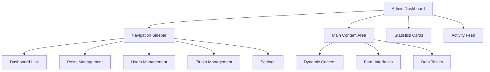
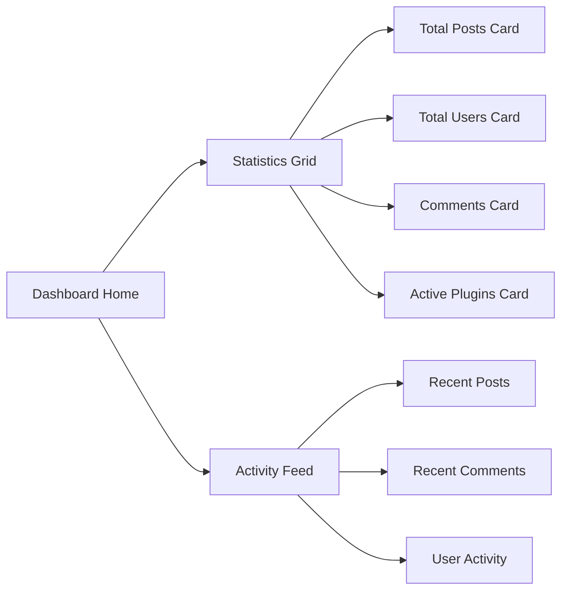
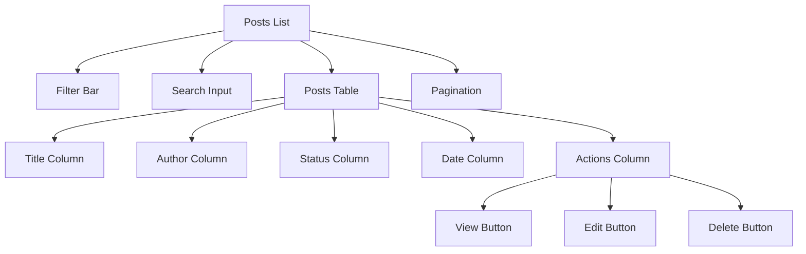
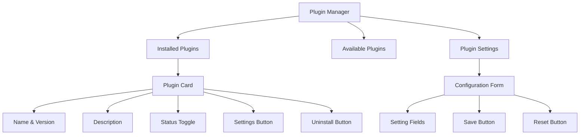
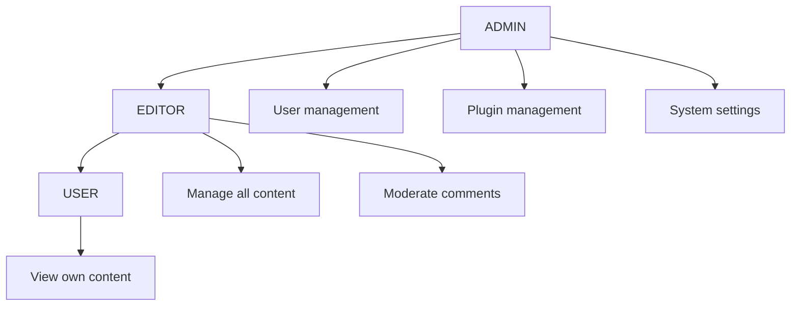

# Admin Dashboard

The Letter-Press admin dashboard provides a comprehensive interface for content management, user administration, and system configuration.

## Dashboard Overview



## Layout Structure

### Admin Layout Component

```typescript
// /src/routes/admin/layout.tsx
export default function AdminLayout() {
  return (
    <div class="min-h-screen bg-gray-50">
      <Sidebar />
      <main class="lg:pl-72">
        <div class="xl:pl-96">
          <div class="px-4 py-10 sm:px-6 lg:px-8 lg:py-6">
            <Outlet />
          </div>
        </div>
      </main>
    </div>
  );
}
```

### Responsive Design

- **Mobile**: Collapsible sidebar with overlay
- **Tablet**: Fixed sidebar with reduced width
- **Desktop**: Full sidebar with secondary panel

## Dashboard Pages

### Main Dashboard



#### Statistics Implementation

```typescript
// Real-time statistics with database aggregation
const stats = await db.post.groupBy({
  by: ["status"],
  _count: { id: true },
});

const userCount = await db.user.count();
const commentCount = await db.comment.count({
  where: { status: "APPROVED" },
});
```

### Posts Management

#### Post Listing

- **Filters**: Status, Author, Category, Date range
- **Search**: Title and content search
- **Bulk Actions**: Publish, Archive, Delete
- **Pagination**: Server-side pagination with page size controls



#### Post Editor

- **Rich Text Editor**: WYSIWYG with markdown support
- **SEO Fields**: Meta title, description, slug
- **Publishing Options**: Status, publish date, categories, tags
- **Custom Fields**: Plugin-defined metadata

### Users Management

#### User Interface

```typescript
interface UserManagement {
  listing: {
    filters: ["role", "status", "registrationDate"];
    search: ["name", "email"];
    actions: ["edit", "suspend", "delete"];
  };
  profile: {
    basicInfo: ["name", "email", "image"];
    permissions: ["role", "capabilities"];
    activity: ["lastLogin", "postCount", "commentCount"];
  };
}
```

### Plugin Management



#### Plugin Status Management

```typescript
// Real-time plugin status updates
const togglePlugin = async (pluginName: string, enabled: boolean) => {
  if (enabled) {
    await pluginManager.activatePlugin(pluginName);
  } else {
    await pluginManager.deactivatePlugin(pluginName);
  }

  // Update UI state
  setPluginStatus(pluginName, enabled);
};
```

## Component Architecture

### Reusable Components

#### Statistics Card

```typescript
interface StatsCardProps {
  title: string;
  value: number;
  change?: {
    value: number;
    type: "increase" | "decrease";
  };
  icon: JSX.Element;
}

function StatsCard(props: StatsCardProps) {
  return (
    <div class="bg-white overflow-hidden shadow rounded-lg">
      <div class="p-5">
        <div class="flex items-center">
          <div class="flex-shrink-0">{props.icon}</div>
          <div class="ml-5 w-0 flex-1">
            <dl>
              <dt class="text-sm font-medium text-gray-500 truncate">
                {props.title}
              </dt>
              <dd class="text-lg font-medium text-gray-900">
                {props.value.toLocaleString()}
              </dd>
            </dl>
          </div>
        </div>
      </div>
    </div>
  );
}
```

#### Data Table

```typescript
interface DataTableProps<T> {
  data: T[];
  columns: Column<T>[];
  pagination?: PaginationOptions;
  loading?: boolean;
  onRowClick?: (row: T) => void;
}

interface Column<T> {
  key: keyof T;
  title: string;
  render?: (value: T[keyof T], row: T) => JSX.Element;
  sortable?: boolean;
}
```

### Form Components

#### Settings Form

```typescript
interface SettingField {
  key: string;
  type: "string" | "number" | "boolean" | "select";
  label: string;
  description?: string;
  required?: boolean;
  options?: { value: string; label: string }[];
}

function SettingsForm(props: { fields: SettingField[] }) {
  const [values, setValues] = createSignal<Record<string, any>>({});

  return (
    <form onSubmit={handleSubmit}>
      <For each={props.fields}>
        {(field) => (
          <div class="mb-6">
            <label class="block text-sm font-medium text-gray-700">
              {field.label}
              {field.required && <span class="text-red-500">*</span>}
            </label>
            <FieldInput field={field} value={values()[field.key]} />
            {field.description && (
              <p class="mt-1 text-sm text-gray-500">{field.description}</p>
            )}
          </div>
        )}
      </For>
    </form>
  );
}
```

## Authentication & Authorization

### Route Protection

```typescript
// Admin route protection
function AdminRoute(props: { children: JSX.Element }) {
  const session = useSession();

  return (
    <Show
      when={session()?.user?.role === "ADMIN"}
      fallback={<Navigate href="/login" />}
    >
      {props.children}
    </Show>
  );
}
```

### Permission Levels



## Real-time Features

### Live Updates

```typescript
// WebSocket connection for live updates
const [activityFeed, setActivityFeed] = createSignal<Activity[]>([]);

onMount(() => {
  const ws = new WebSocket("/api/admin/live");

  ws.onmessage = (event) => {
    const activity = JSON.parse(event.data);
    setActivityFeed((prev) => [activity, ...prev.slice(0, 9)]);
  };
});
```

### Status Indicators

- **Plugin Status**: Real-time enabled/disabled state
- **User Activity**: Online/offline indicators
- **System Health**: Performance metrics
- **Update Notifications**: New content alerts

## Performance Optimization

### Data Loading

```typescript
// Efficient data loading with caching
const [posts] = createResource(
  () => ({ page: currentPage(), filters: filters() }),
  async ({ page, filters }) => {
    return await fetchPosts({
      page,
      limit: 20,
      ...filters,
      select: {
        id: true,
        title: true,
        status: true,
        createdAt: true,
        author: { select: { name: true } },
      },
    });
  }
);
```

### Virtual Scrolling

- Large dataset handling
- Memory efficient rendering
- Smooth scrolling performance

## Mobile Responsiveness

### Breakpoint Strategy

```css
/* Tailwind CSS responsive design */
.admin-layout {
  @apply min-h-screen bg-gray-50;
}

.sidebar {
  @apply fixed inset-y-0 left-0 z-50 w-72 bg-white;
  @apply lg:static lg:inset-auto lg:z-auto;
}

.main-content {
  @apply lg:pl-72;
}

.content-panel {
  @apply px-4 py-10 sm:px-6 lg:px-8 lg:py-6;
}
```

### Touch Interactions

- Swipe gestures for navigation
- Touch-friendly button sizing
- Responsive form controls

## Accessibility

### ARIA Support

```typescript
// Accessible navigation
<nav role="navigation" aria-label="Admin navigation">
  <ul>
    <li>
      <a
        href="/admin"
        class={isActive("/admin") ? "active" : ""}
        aria-current={isActive("/admin") ? "page" : undefined}
      >
        Dashboard
      </a>
    </li>
  </ul>
</nav>
```

### Keyboard Navigation

- Tab order management
- Keyboard shortcuts
- Focus management
- Screen reader support

## Customization

### Theming

```typescript
interface AdminTheme {
  colors: {
    primary: string;
    secondary: string;
    accent: string;
    background: string;
  };
  spacing: {
    sidebar: string;
    content: string;
  };
  typography: {
    headings: string;
    body: string;
  };
}
```

### Plugin Extensions

- Custom admin pages
- Dashboard widgets
- Menu items
- Form fields
