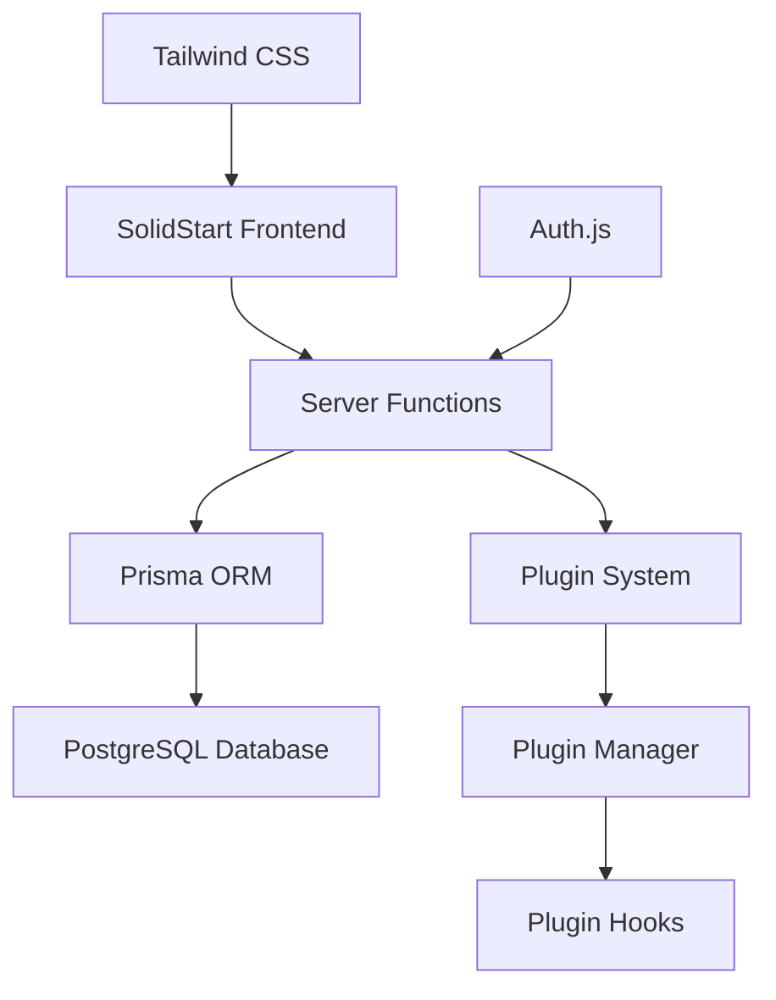
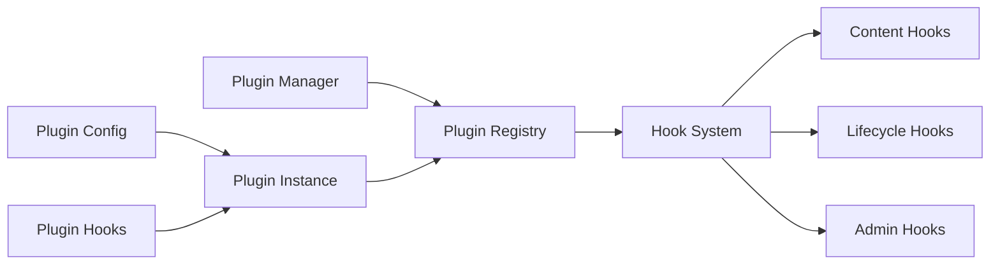
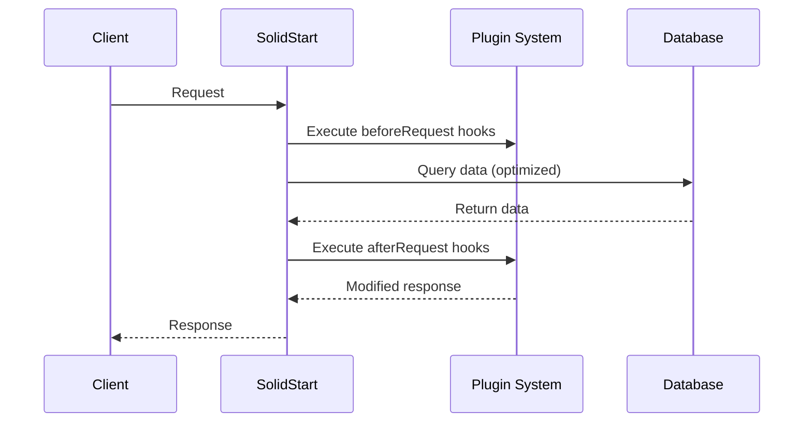
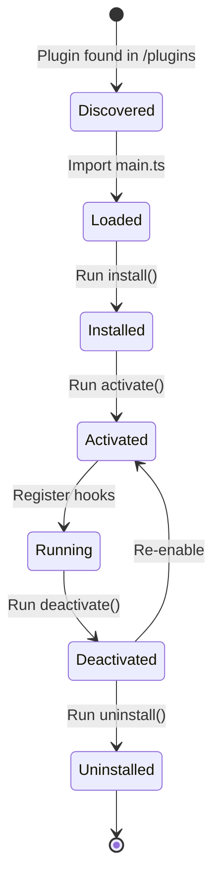
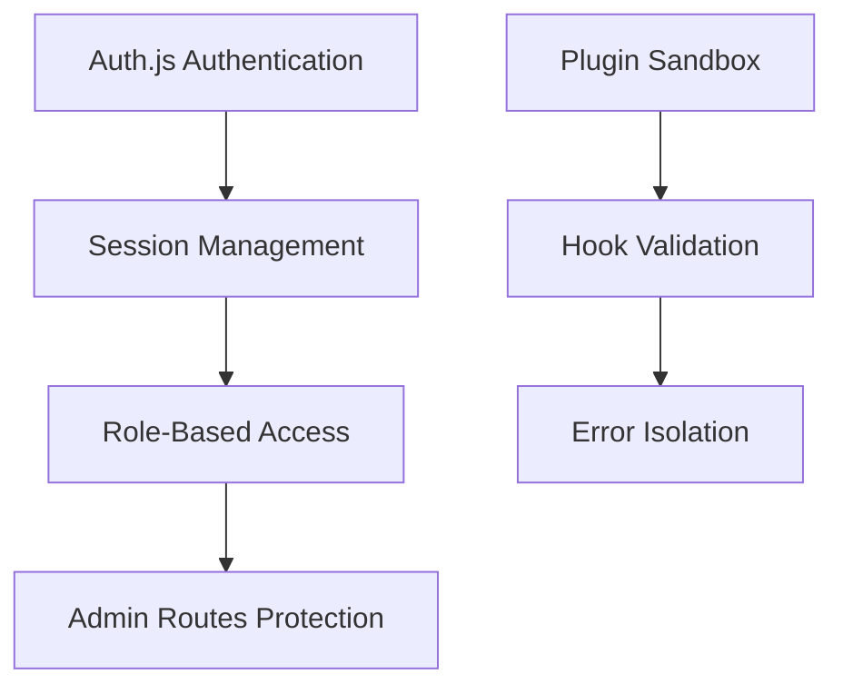

# Architecture Overview

LetterPress CMS is built with a modern TypeScript stack emphasizing type safety, performance, and extensibility through a plugin system.

## Technology Stack



## Core Components

### Database Layer
- **Prisma ORM**: Type-safe database access
- **PostgreSQL**: Primary database with advanced features
- **Optimized Queries**: Using `select` over `include`, `groupBy` aggregations

### Application Layer
- **SolidStart**: Full-stack framework with SSR
- **Server Functions**: Type-safe server-side operations
- **Error Handling**: Discriminated unions with `tryCatch` utility

### Plugin Architecture



## File Structure

```
src/
├── lib/
│   ├── db.ts                    # Prisma client
│   ├── try-catch.ts            # Error handling utility
│   ├── queries.ts              # Optimized database queries
│   ├── cms-utils.ts            # CMS utility functions
│   ├── plugin-types.ts         # Plugin type definitions
│   ├── plugin-manager.ts       # Plugin management logic
│   ├── plugin-system.ts        # Plugin initialization
│   └── index.ts                # Library exports
├── routes/
│   ├── admin/
│   │   ├── dashboard.tsx       # Admin dashboard
│   │   ├── layout.tsx          # Admin layout component
│   │   ├── plugins.tsx         # Plugin management UI
│   │   └── users.tsx           # User management UI
│   └── index.tsx               # Homepage
└── server/
    └── auth.ts                 # Authentication configuration
```

## Data Flow



## Plugin Lifecycle



## Performance Optimizations

### Database Level
- `groupBy` aggregations instead of multiple queries
- `select` specific fields instead of full records
- Raw SQL for complex date operations
- Database-level filtering and sorting

### Application Level
- Type-safe error handling with discriminated unions
- Lazy loading with Suspense boundaries
- Plugin hook execution optimization
- Memory-efficient plugin management

## Security Model



## Extension Points

### Plugin Hooks
- Content lifecycle: `beforePostCreate`, `afterPostCreate`
- Server lifecycle: `onServerStart`, `onServerStop`
- Custom registration: `registerPostTypes`, `registerMetaFields`

### Admin Interface
- Custom admin pages
- Plugin settings UI
- Dashboard widgets
- Navigation extensions
