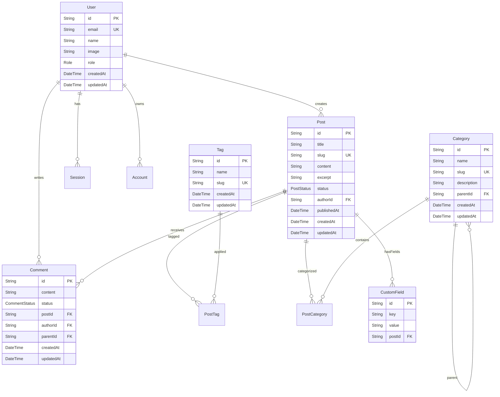
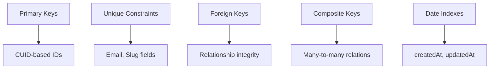

# Database Schema

Letter-Press uses a PostgreSQL database with Prisma ORM for type-safe access. The schema supports a flexible CMS structure with extensibility.

## Entity Relationship Diagram



## Core Tables

### User Management
```sql
-- Users with role-based access
User {
  id: String @id @default(cuid())
  email: String @unique
  name: String?
  image: String?
  role: Role @default(USER)
  emailVerified: DateTime?
  createdAt: DateTime @default(now())
  updatedAt: DateTime @updatedAt
}

-- Authentication sessions (Auth.js)
Session {
  id: String @id @default(cuid())
  sessionToken: String @unique
  userId: String
  expires: DateTime
  user: User @relation(fields: [userId], references: [id], onDelete: Cascade)
}

-- OAuth accounts (Auth.js)
Account {
  id: String @id @default(cuid())
  userId: String
  type: String
  provider: String
  providerAccountId: String
  refresh_token: String?
  access_token: String?
  expires_at: Int?
  token_type: String?
  scope: String?
  id_token: String?
  session_state: String?
  user: User @relation(fields: [userId], references: [id], onDelete: Cascade)
}
```

### Content Management
```sql
-- Posts with hierarchical structure
Post {
  id: String @id @default(cuid())
  title: String
  slug: String @unique
  content: String
  excerpt: String?
  status: PostStatus @default(DRAFT)
  authorId: String
  publishedAt: DateTime?
  createdAt: DateTime @default(now())
  updatedAt: DateTime @updatedAt
  
  author: User @relation(fields: [authorId], references: [id])
  categories: PostCategory[]
  tags: PostTag[]
  comments: Comment[]
  customFields: CustomField[]
}

-- Categories with hierarchical nesting
Category {
  id: String @id @default(cuid())
  name: String
  slug: String @unique
  description: String?
  parentId: String?
  createdAt: DateTime @default(now())
  updatedAt: DateTime @updatedAt
  
  parent: Category? @relation("CategoryHierarchy", fields: [parentId], references: [id])
  children: Category[] @relation("CategoryHierarchy")
  posts: PostCategory[]
}

-- Tags for flexible content organization
Tag {
  id: String @id @default(cuid())
  name: String
  slug: String @unique
  createdAt: DateTime @default(now())
  updatedAt: DateTime @updatedAt
  
  posts: PostTag[]
}
```

### Relationships
```sql
-- Many-to-many: Posts and Categories
PostCategory {
  postId: String
  categoryId: String
  
  post: Post @relation(fields: [postId], references: [id], onDelete: Cascade)
  category: Category @relation(fields: [categoryId], references: [id], onDelete: Cascade)
  
  @@id([postId, categoryId])
}

-- Many-to-many: Posts and Tags
PostTag {
  postId: String
  tagId: String
  
  post: Post @relation(fields: [postId], references: [id], onDelete: Cascade)
  tag: Tag @relation(fields: [tagId], references: [id], onDelete: Cascade)
  
  @@id([postId, tagId])
}

-- Comments with threading support
Comment {
  id: String @id @default(cuid())
  content: String
  status: CommentStatus @default(PENDING)
  postId: String
  authorId: String?
  parentId: String?
  createdAt: DateTime @default(now())
  updatedAt: DateTime @updatedAt
  
  post: Post @relation(fields: [postId], references: [id], onDelete: Cascade)
  author: User? @relation(fields: [authorId], references: [id])
  parent: Comment? @relation("CommentThread", fields: [parentId], references: [id])
  replies: Comment[] @relation("CommentThread")
}

-- Extensible metadata system
CustomField {
  id: String @id @default(cuid())
  key: String
  value: String
  postId: String
  
  post: Post @relation(fields: [postId], references: [id], onDelete: Cascade)
  
  @@unique([postId, key])
}
```

## Enumerations

```sql
enum Role {
  USER
  EDITOR
  ADMIN
}

enum PostStatus {
  DRAFT
  PUBLISHED
  ARCHIVED
}

enum CommentStatus {
  PENDING
  APPROVED
  REJECTED
}
```

## Indexing Strategy



### Key Indexes
- **User.email**: Unique index for authentication
- **Post.slug**: Unique index for SEO-friendly URLs
- **Category.slug**: Unique index for category URLs
- **Tag.slug**: Unique index for tag URLs
- **Post.status + publishedAt**: Composite index for published content queries
- **Comment.postId + status**: Composite index for approved comments

## Query Optimization Patterns

### Aggregation Queries
```typescript
// Using groupBy for statistics
const stats = await db.post.groupBy({
  by: ['status'],
  _count: { id: true }
});

// Category post counts
const categoryStats = await db.category.findMany({
  select: {
    id: true,
    name: true,
    _count: { select: { posts: true } }
  }
});
```

### Efficient Selection
```typescript
// Select only needed fields
const posts = await db.post.findMany({
  select: {
    id: true,
    title: true,
    slug: true,
    publishedAt: true,
    author: {
      select: { name: true, image: true }
    }
  }
});
```

### Hierarchical Queries
```typescript
// Category tree with recursive CTE
const categoryTree = await db.$queryRaw`
  WITH RECURSIVE category_tree AS (
    SELECT id, name, "parentId", 0 as level
    FROM "Category"
    WHERE "parentId" IS NULL
    
    UNION ALL
    
    SELECT c.id, c.name, c."parentId", ct.level + 1
    FROM "Category" c
    JOIN category_tree ct ON c."parentId" = ct.id
  )
  SELECT * FROM category_tree ORDER BY level, name
`;
```

## Migration Strategy

### Initial Setup
```bash
npx prisma db push --preview-feature
npx prisma generate
```

### Schema Updates
```bash
npx prisma migrate dev --name "descriptive_change_name"
```

### Production Deployment
```bash
npx prisma migrate deploy
```
