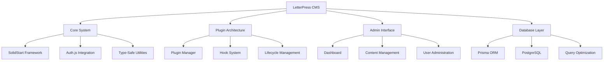

# LetterPress CMS Documentation

LetterPress is a modern, type-safe content management system built with SolidStart, Prisma, and Auth.js. This documentation covers the implemented features and technical architecture.

## System Overview

## Core Documentation

### [Architecture Overview](./Architecture.md)
System architecture, technology stack, and component relationships with performance optimizations and plugin extensibility.

### [Database Schema](./Database-Schema.md) 
Complete database structure including Users, Posts, Categories, Tags, Comments, and Custom Fields with relationship mappings.

### [Plugin Development](./Plugin-Development.md)
Comprehensive guide for developing plugins with hooks, lifecycle management, and custom functionality integration.

### [Admin Dashboard](./Admin-Dashboard.md)
Administrative interface for content management, user administration, plugin management, and system configuration.

### [Query Optimization](./Query-Optimization.md)
Database query optimization strategies using Prisma best practices for performance and type safety.

---

**Last Updated**: July 27, 2025
