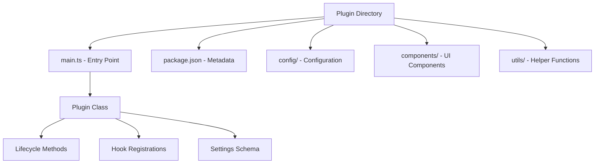
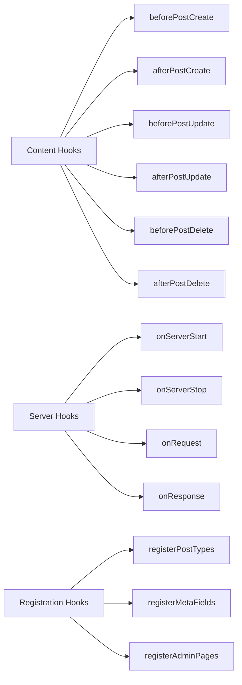
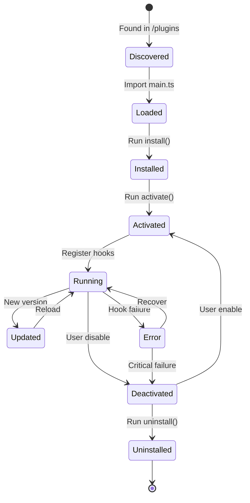

# Plugin Development Guide

Letter-Press features a comprehensive plugin system that allows developers to extend functionality through hooks, custom post types, and admin interfaces.

## Plugin Structure



## Basic Plugin Structure

### Directory Layout
```
plugins/
└── my-plugin/
    ├── main.ts              # Required entry point
    ├── package.json         # Plugin metadata
    ├── config/
    │   └── settings.ts      # Plugin settings
    ├── components/
    │   └── AdminPanel.tsx   # Admin UI components
    └── utils/
        └── helpers.ts       # Utility functions
```

### Entry Point (main.ts)
```typescript
import { Plugin, PluginConfig, PluginHooks } from '../../src/lib/plugin-types';

export default class MyPlugin implements Plugin {
  config: PluginConfig = {
    name: 'My Plugin',
    version: '1.0.0',
    description: 'A sample plugin for Letter-Press',
    author: 'Your Name',
    dependencies: [],
    settings: {
      enableFeature: {
        type: 'boolean',
        default: true,
        label: 'Enable Feature'
      },
      apiKey: {
        type: 'string',
        default: '',
        label: 'API Key',
        required: true
      }
    }
  };

  hooks: PluginHooks = {
    // Content lifecycle hooks
    beforePostCreate: async (data) => {
      console.log('Post about to be created:', data.title);
      return data;
    },

    afterPostCreate: async (post) => {
      console.log('Post created:', post.id);
    },

    // Server lifecycle hooks
    onServerStart: async () => {
      console.log('My Plugin initialized');
    },

    onServerStop: async () => {
      console.log('My Plugin shutting down');
    },

    // Custom registrations
    registerPostTypes: () => [{
      name: 'product',
      label: 'Product',
      fields: [
        { name: 'price', type: 'number', required: true },
        { name: 'sku', type: 'string', required: true }
      ]
    }],

    registerMetaFields: () => [{
      key: 'seo_title',
      label: 'SEO Title',
      type: 'string'
    }]
  };

  async install(): Promise<void> {
    // Run during plugin installation
    console.log('Installing My Plugin...');
  }

  async activate(): Promise<void> {
    // Run when plugin is activated
    console.log('Activating My Plugin...');
  }

  async deactivate(): Promise<void> {
    // Run when plugin is deactivated
    console.log('Deactivating My Plugin...');
  }

  async uninstall(): Promise<void> {
    // Run during plugin removal
    console.log('Uninstalling My Plugin...');
  }

  getSetting<T>(key: string): T {
    // Access plugin settings
    return this.config.settings[key]?.default as T;
  }
}
```

## Hook System

### Available Hooks



### Hook Examples

#### Content Lifecycle
```typescript
hooks: {
  beforePostCreate: async (data) => {
    // Validate or modify post data before creation
    if (!data.excerpt && data.content) {
      data.excerpt = data.content.substring(0, 150) + '...';
    }
    return data;
  },

  afterPostCreate: async (post) => {
    // Perform actions after post creation
    await sendNotification(`New post: ${post.title}`);
  },

  beforePostUpdate: async (id, data) => {
    // Modify data before update
    data.updatedAt = new Date();
    return data;
  }
}
```

#### Server Lifecycle
```typescript
hooks: {
  onServerStart: async () => {
    // Initialize external services
    await connectToExternalAPI();
  },

  onRequest: async (request) => {
    // Middleware functionality
    console.log(`Request to: ${request.url}`);
    return request;
  }
}
```

#### Custom Registrations
```typescript
hooks: {
  registerPostTypes: () => [
    {
      name: 'event',
      label: 'Event',
      fields: [
        { name: 'startDate', type: 'datetime', required: true },
        { name: 'endDate', type: 'datetime', required: true },
        { name: 'location', type: 'string', required: false }
      ]
    }
  ],

  registerMetaFields: () => [
    { key: 'og_image', label: 'Social Media Image', type: 'url' },
    { key: 'featured', label: 'Featured Post', type: 'boolean' }
  ]
}
```

## Plugin Settings

### Settings Schema
```typescript
settings: {
  apiEndpoint: {
    type: 'string',
    default: 'https://api.example.com',
    label: 'API Endpoint',
    description: 'The API endpoint for external service',
    required: true,
    validation: (value) => {
      return value.startsWith('https://') || 'Must be HTTPS URL';
    }
  },
  cacheTimeout: {
    type: 'number',
    default: 3600,
    label: 'Cache Timeout (seconds)',
    min: 60,
    max: 86400
  },
  enableLogging: {
    type: 'boolean',
    default: false,
    label: 'Enable Debug Logging'
  }
}
```

### Accessing Settings
```typescript
class MyPlugin implements Plugin {
  async activate(): Promise<void> {
    const apiUrl = this.getSetting<string>('apiEndpoint');
    const timeout = this.getSetting<number>('cacheTimeout');
    const logging = this.getSetting<boolean>('enableLogging');
    
    // Use settings to configure plugin behavior
    this.configureAPI(apiUrl, timeout, logging);
  }
}
```

## Error Handling

### Plugin Error Isolation
```typescript
hooks: {
  beforePostCreate: async (data) => {
    try {
      // Plugin logic that might fail
      const enhanced = await enhancePostData(data);
      return enhanced;
    } catch (error) {
      // Log error but don't break the chain
      console.error('Plugin error:', error);
      return data; // Return original data
    }
  }
}
```

### Error Reporting
```typescript
class MyPlugin implements Plugin {
  private async handleError(error: Error, context: string): Promise<void> {
    console.error(`[${this.config.name}] Error in ${context}:`, error);
    
    // Report to external service if configured
    if (this.getSetting<boolean>('reportErrors')) {
      await this.reportError(error, context);
    }
  }
}
```

## Advanced Features

### Database Operations
```typescript
import { db } from '../../src/lib/db';

hooks: {
  afterPostCreate: async (post) => {
    // Create custom database records
    await db.customField.create({
      data: {
        key: 'plugin_metadata',
        value: JSON.stringify({ processed: true }),
        postId: post.id
      }
    });
  }
}
```

### Custom Admin Pages
```typescript
hooks: {
  registerAdminPages: () => [
    {
      path: '/admin/my-plugin',
      title: 'My Plugin Settings',
      component: () => import('./components/AdminPanel.tsx'),
      permission: 'admin'
    }
  ]
}
```

### External API Integration
```typescript
class APIPlugin implements Plugin {
  private apiClient: APIClient;

  async activate(): Promise<void> {
    this.apiClient = new APIClient({
      endpoint: this.getSetting<string>('apiEndpoint'),
      apiKey: this.getSetting<string>('apiKey')
    });
  }

  hooks: PluginHooks = {
    afterPostCreate: async (post) => {
      // Sync with external service
      await this.apiClient.syncPost(post);
    }
  };
}
```

## Plugin Lifecycle



## Testing Plugins

### Unit Testing
```typescript
// tests/my-plugin.test.ts
import MyPlugin from '../plugins/my-plugin/main';

describe('MyPlugin', () => {
  let plugin: MyPlugin;

  beforeEach(() => {
    plugin = new MyPlugin();
  });

  test('should enhance post data', async () => {
    const mockData = { title: 'Test Post', content: 'Test content' };
    const result = await plugin.hooks.beforePostCreate!(mockData);
    
    expect(result.excerpt).toBeDefined();
    expect(result.excerpt).toContain('Test content');
  });
});
```

### Integration Testing
```typescript
// Test plugin in development environment
const testPlugin = async () => {
  const manager = new PluginManager();
  await manager.loadPlugin('./plugins/my-plugin');
  
  const plugin = manager.getPlugin('my-plugin');
  await plugin?.activate();
  
  // Test hook execution
  const result = await manager.executeHook('beforePostCreate', {
    title: 'Test',
    content: 'Content'
  });
  
  console.log('Hook result:', result);
};
```

## Distribution

### Package.json
```json
{
  "name": "letter-press-my-plugin",
  "version": "1.0.0",
  "description": "A sample plugin for Letter-Press CMS",
  "main": "main.ts",
  "keywords": ["letterpress", "cms", "plugin"],
  "author": "Your Name",
  "license": "MIT",
  "peerDependencies": {
    "letterpress": "^1.0.0"
  }
}
```

### Installation
```bash
# Install in plugins directory
cd plugins/
git clone https://github.com/user/letter-press-my-plugin.git my-plugin
```

The plugin will be automatically discovered and loaded on server restart.
