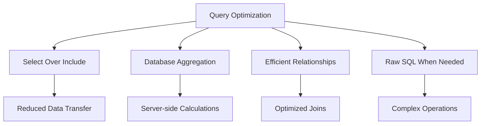
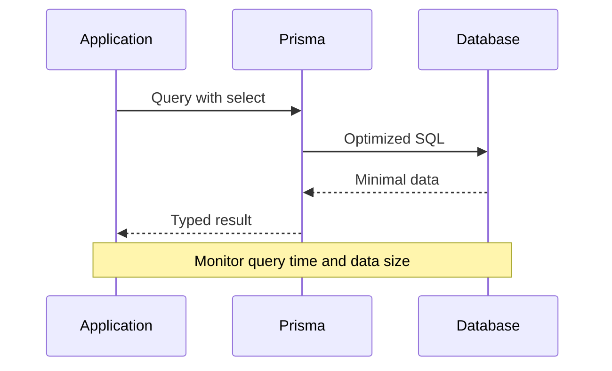

# Query Optimization

Letter-Press implements database query optimizations based on Prisma best practices, focusing on performance, type safety, and efficient data fetching.

## Optimization Strategies



## Core Optimization Patterns

### Select vs Include
**Avoid** using `include` when only specific fields are needed:

```typescript
// ❌ Inefficient - loads all fields
const posts = await db.post.findMany({
  include: {
    author: true,
    categories: true
  }
});

// ✅ Optimized - only necessary fields
const posts = await db.post.findMany({
  select: {
    id: true,
    title: true,
    slug: true,
    publishedAt: true,
    author: {
      select: {
        name: true,
        image: true
      }
    },
    categories: {
      select: {
        category: {
          select: {
            name: true,
            slug: true
          }
        }
      }
    }
  }
});
```

### Database Aggregation
Replace multiple queries with single aggregation operations:

```typescript
// ❌ Multiple queries
const totalPosts = await db.post.count();
const publishedPosts = await db.post.count({ where: { status: 'PUBLISHED' } });
const draftPosts = await db.post.count({ where: { status: 'DRAFT' } });

// ✅ Single aggregation query
const postStats = await db.post.groupBy({
  by: ['status'],
  _count: {
    id: true
  }
});
```

## Implemented Optimizations

### Content Statistics
```typescript
// Efficient dashboard statistics
export async function getDashboardStats() {
  // Single query for post statistics by status
  const postStats = await db.post.groupBy({
    by: ['status'],
    _count: { id: true }
  });

  // Parallel execution of independent queries
  const [userCount, commentCount, pluginCount] = await Promise.all([
    db.user.count(),
    db.comment.count({ where: { status: 'APPROVED' } }),
    getActivePluginCount()
  ]);

  return {
    posts: Object.fromEntries(
      postStats.map(stat => [stat.status, stat._count.id])
    ),
    users: userCount,
    comments: commentCount,
    plugins: pluginCount
  };
}
```

### Category Tree with Counts
```typescript
// Optimized category listing with post counts
export async function getCategoriesWithCounts() {
  return await db.category.findMany({
    select: {
      id: true,
      name: true,
      slug: true,
      description: true,
      _count: {
        select: {
          posts: {
            where: {
              post: { status: 'PUBLISHED' }
            }
          }
        }
      }
    },
    orderBy: { name: 'asc' }
  });
}
```

### Efficient Post Listing
```typescript
export async function getPostsPage(params: PostListParams) {
  const { page = 1, limit = 10, status, authorId, categoryId } = params;
  
  const where = {
    ...(status && { status }),
    ...(authorId && { authorId }),
    ...(categoryId && {
      categories: {
        some: { categoryId }
      }
    })
  };

  // Parallel execution for data and count
  const [posts, total] = await Promise.all([
    db.post.findMany({
      where,
      select: {
        id: true,
        title: true,
        slug: true,
        status: true,
        publishedAt: true,
        createdAt: true,
        author: {
          select: {
            name: true,
            image: true
          }
        },
        _count: {
          select: {
            comments: {
              where: { status: 'APPROVED' }
            }
          }
        }
      },
      orderBy: { createdAt: 'desc' },
      skip: (page - 1) * limit,
      take: limit
    }),
    db.post.count({ where })
  ]);

  return {
    posts,
    pagination: {
      page,
      limit,
      total,
      pages: Math.ceil(total / limit)
    }
  };
}
```

## Advanced Optimizations

### Recursive Category Queries
For hierarchical data, use raw SQL with recursive CTEs:

```typescript
export async function getCategoryTree() {
  return await db.$queryRaw<CategoryTree[]>`
    WITH RECURSIVE category_tree AS (
      -- Base case: root categories
      SELECT 
        id, 
        name, 
        slug,
        "parentId",
        0 as level,
        ARRAY[name] as path
      FROM "Category"
      WHERE "parentId" IS NULL
      
      UNION ALL
      
      -- Recursive case: child categories
      SELECT 
        c.id,
        c.name,
        c.slug,
        c."parentId",
        ct.level + 1,
        ct.path || c.name
      FROM "Category" c
      JOIN category_tree ct ON c."parentId" = ct.id
    )
    SELECT 
      id,
      name,
      slug,
      "parentId",
      level,
      path
    FROM category_tree 
    ORDER BY level, name
  `;
}
```

### Time-based Aggregations
```typescript
export async function getPostAnalytics(days: number = 30) {
  const startDate = new Date();
  startDate.setDate(startDate.getDate() - days);

  return await db.$queryRaw<AnalyticsData[]>`
    SELECT 
      DATE_TRUNC('day', "createdAt") as date,
      COUNT(*) as posts_created,
      COUNT(CASE WHEN status = 'PUBLISHED' THEN 1 END) as posts_published
    FROM "Post"
    WHERE "createdAt" >= ${startDate}
    GROUP BY DATE_TRUNC('day', "createdAt")
    ORDER BY date DESC
  `;
}
```

## Performance Monitoring

### Query Performance Tracking


### Metrics Implementation
```typescript
export class QueryMetrics {
  private static metrics: Map<string, QueryStat> = new Map();

  static async trackQuery<T>(
    name: string,
    queryFn: () => Promise<T>
  ): Promise<T> {
    const start = performance.now();
    
    try {
      const result = await queryFn();
      const duration = performance.now() - start;
      
      this.updateMetric(name, duration, true);
      return result;
    } catch (error) {
      const duration = performance.now() - start;
      this.updateMetric(name, duration, false);
      throw error;
    }
  }

  private static updateMetric(name: string, duration: number, success: boolean) {
    const existing = this.metrics.get(name) || {
      count: 0,
      totalTime: 0,
      avgTime: 0,
      errors: 0
    };

    existing.count++;
    existing.totalTime += duration;
    existing.avgTime = existing.totalTime / existing.count;
    
    if (!success) {
      existing.errors++;
    }

    this.metrics.set(name, existing);
  }
}
```

## Caching Strategies

### Query Result Caching
```typescript
export class QueryCache {
  private cache: Map<string, CacheEntry> = new Map();
  private ttl: number = 5 * 60 * 1000; // 5 minutes

  async get<T>(key: string, queryFn: () => Promise<T>): Promise<T> {
    const cached = this.cache.get(key);
    
    if (cached && cached.expires > Date.now()) {
      return cached.data as T;
    }

    const data = await queryFn();
    this.cache.set(key, {
      data,
      expires: Date.now() + this.ttl
    });

    return data;
  }

  invalidate(pattern: string): void {
    for (const key of this.cache.keys()) {
      if (key.includes(pattern)) {
        this.cache.delete(key);
      }
    }
  }
}

// Usage
const cache = new QueryCache();

export async function getCachedPosts(categoryId?: string) {
  const key = `posts:${categoryId || 'all'}`;
  
  return await cache.get(key, () =>
    db.post.findMany({
      select: {
        id: true,
        title: true,
        slug: true,
        publishedAt: true
      },
      where: categoryId ? {
        categories: { some: { categoryId } }
      } : undefined
    })
  );
}
```

## Best Practices

### 1. Always Use Select for Specific Fields
```typescript
// ✅ Good
const user = await db.user.findUnique({
  where: { id },
  select: {
    id: true,
    name: true,
    email: true
  }
});
```

### 2. Batch Related Queries
```typescript
// ✅ Efficient batching
const [posts, categories, tags] = await Promise.all([
  db.post.findMany({ select: { id: true, title: true } }),
  db.category.findMany({ select: { id: true, name: true } }),
  db.tag.findMany({ select: { id: true, name: true } })
]);
```

### 3. Use Database-Level Filtering
```typescript
// ✅ Filter in database, not in application
const recentPosts = await db.post.findMany({
  where: {
    publishedAt: {
      gte: new Date(Date.now() - 7 * 24 * 60 * 60 * 1000)
    },
    status: 'PUBLISHED'
  },
  select: {
    id: true,
    title: true,
    publishedAt: true
  }
});
```

### 4. Implement Pagination Efficiently
```typescript
// ✅ Cursor-based pagination for large datasets
export async function getPostsCursor(cursor?: string, limit: number = 10) {
  return await db.post.findMany({
    take: limit,
    ...(cursor && {
      cursor: { id: cursor },
      skip: 1
    }),
    select: {
      id: true,
      title: true,
      createdAt: true
    },
    orderBy: { createdAt: 'desc' }
  });
}
```

## Query Analysis Tools

### Prisma Query Insights
```typescript
// Enable query logging in development
const db = new PrismaClient({
  log: [
    { level: 'query', emit: 'event' },
    { level: 'info', emit: 'stdout' },
    { level: 'warn', emit: 'stdout' },
    { level: 'error', emit: 'stdout' }
  ]
});

db.$on('query', (e) => {
  console.log('Query: ' + e.query);
  console.log('Duration: ' + e.duration + 'ms');
});
```

### Performance Benchmarks
```typescript
export async function benchmarkQueries() {
  const tests = [
    {
      name: 'Posts with select',
      query: () => db.post.findMany({
        select: { id: true, title: true }
      })
    },
    {
      name: 'Posts with include',
      query: () => db.post.findMany({
        include: { author: true }
      })
    }
  ];

  for (const test of tests) {
    const start = performance.now();
    await test.query();
    const duration = performance.now() - start;
    console.log(`${test.name}: ${duration.toFixed(2)}ms`);
  }
}
```

## Database Indexing

### Recommended Indexes
```sql
-- Composite indexes for common queries
CREATE INDEX idx_post_status_published ON "Post"(status, "publishedAt") 
WHERE status = 'PUBLISHED';

CREATE INDEX idx_comment_post_status ON "Comment"("postId", status) 
WHERE status = 'APPROVED';

CREATE INDEX idx_post_author_created ON "Post"("authorId", "createdAt");

-- Partial indexes for active content
CREATE INDEX idx_active_posts ON "Post"("createdAt") 
WHERE status IN ('PUBLISHED', 'DRAFT');
```

This optimization strategy ensures Letter-Press maintains high performance while handling complex CMS operations and scaling effectively with growing content volumes.
