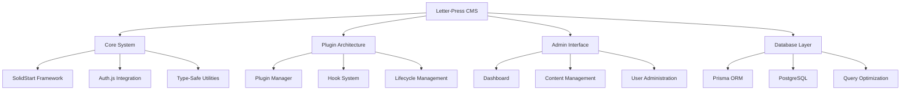

# Letter-Press CMS - System Overview

> Modern, type-safe content management system built with SolidStart, Prisma, and Auth.js

## 🚀 Quick Access

| **Get Started** | **Develop** | **Deploy** | **Support** |
|:---:|:---:|:---:|:---:|
| [📚 All Docs](./README.md) | [🔌 Plugin Dev](./Plugin-Development.md) | [🚀 Deploy Guide](./Deployment.md) | [❓ Troubleshoot](./Troubleshooting.md) |
| [🏗️ Architecture](./Architecture.md) | [📖 API Reference](./API-Reference.md) | [🎛️ Admin Panel](./Admin-Dashboard.md) | [🗄️ Database](./Database-Schema.md) |

---

## What is Letter-Press?

Letter-Press is designed for developers who want:
- **Type Safety**: Full TypeScript support from database to frontend
- **Performance**: Optimized queries and minimal runtime overhead  
- **Extensibility**: Rich plugin system with hooks and lifecycle management
- **Modern Stack**: Built with SolidJS, SolidStart, and contemporary web standards
- **Developer Experience**: Intuitive APIs, comprehensive tooling, and excellent documentation

## 🎯 Common Tasks

### For Plugin Developers
```bash
# Create a new plugin
mkdir plugins/my-plugin && cd plugins/my-plugin
# See: Plugin Development Guide →
```
👉 **[Start with Plugin Development Guide](./Plugin-Development.md)**

### For Site Administrators
```bash
# Access admin dashboard
http://localhost:3000/admin
# See: Admin Dashboard Guide →
```
👉 **[Admin Dashboard Documentation](./Admin-Dashboard.md)**

### For DevOps/Deployment
```bash
# Deploy to production
pnpm build && pnpm start
# See: Deployment Guide →
```
👉 **[Complete Deployment Guide](./Deployment.md)**

## 🔧 Key Features

### Plugin Architecture
- **Hook System**: Content lifecycle, server events, custom registrations
- **Custom Types**: Define custom post types and meta fields
- **Admin Extensions**: Add custom admin pages and widgets
- **Error Isolation**: Plugins can't break core functionality

### Admin Interface
- **Dashboard**: Real-time metrics and content overview
- **Block Editor**: Modern content editing with extensible blocks
- **User Management**: Role-based access control (admin, editor, author, subscriber)
- **Plugin Manager**: Install, configure, and manage plugins

### Database & Performance
- **Prisma ORM**: Type-safe database operations with PostgreSQL
- **Query Optimization**: Efficient queries with proper indexing
- **Caching**: Built-in caching strategies for better performance
- **Migrations**: Automated schema management

### Security
- **Auth.js**: Multiple authentication providers
- **RBAC**: Role-based access control
- **Session Management**: Secure session handling
- **Plugin Sandbox**: Isolated plugin execution

## 🏗️ System Architecture



## ⚡ Quick Start

### Prerequisites
- Node.js 18+
- PostgreSQL database  
- pnpm (recommended)

### 5-Minute Setup
```bash
# 1. Clone and install
git clone <repo> && cd letter-press
pnpm install

# 2. Configure database
cp .env.example .env
# Edit .env with your database URL

# 3. Setup database
pnpm db:migrate

# 4. Start development
pnpm dev
```

### First Steps
1. **Admin Setup**: Navigate to `http://localhost:3000/admin`
2. **Create Content**: Add your first post or page
3. **Explore Plugins**: Check out `/plugins` directory
4. **Customize**: Start with [Plugin Development](./Plugin-Development.md)

## 🛠️ Technology Stack

| Layer | Technology | Purpose |
|-------|------------|---------|
| **Frontend** | SolidJS + SolidStart | Reactive UI with SSR |
| **Styling** | Tailwind CSS | Utility-first CSS |
| **Backend** | Node.js + Server Functions | Type-safe server operations |
| **Database** | PostgreSQL + Prisma | Relational data with type safety |
| **Auth** | Auth.js | Multi-provider authentication |
| **Plugins** | Custom System | Extensible architecture |

## 📚 Documentation

### Essential Reading
- **[🔌 Plugin Development](./Plugin-Development.md)** - Create custom functionality
- **[📖 API Reference](./API-Reference.md)** - Complete API documentation
- **[🏗️ Architecture](./Architecture.md)** - System design deep dive

### Administration
- **[🎛️ Admin Dashboard](./Admin-Dashboard.md)** - Managing content and users
- **[🔐 Authentication](./Authentication-Middleware.md)** - Security configuration
- **[🗄️ Database Schema](./Database-Schema.md)** - Data structure

### Operations
- **[🚀 Deployment](./Deployment.md)** - Production deployment
- **[⚡ Query Optimization](./Query-Optimization.md)** - Performance tuning
- **[❓ Troubleshooting](./Troubleshooting.md)** - Common issues

## 💡 Getting Help

### Quick Links
- **Plugin Issues**: [Plugin Dev Guide](./Plugin-Development.md) → [API Reference](./API-Reference.md) → [Troubleshooting](./Troubleshooting.md)
- **Deployment Problems**: [Deployment Guide](./Deployment.md) → [Troubleshooting](./Troubleshooting.md)
- **Database Questions**: [Database Schema](./Database-Schema.md) → [Query Optimization](./Query-Optimization.md)

### Community
- **GitHub Discussions**: Ask questions and share solutions
- **Discord Server**: Real-time community support  
- **Stack Overflow**: Tag with `letter-press-cms`

---

**Last Updated**: August 9, 2025 | **Version**: 1.0.0 | **[📚 All Documentation](./README.md)**